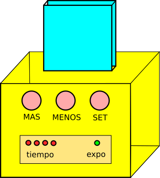
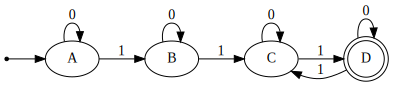
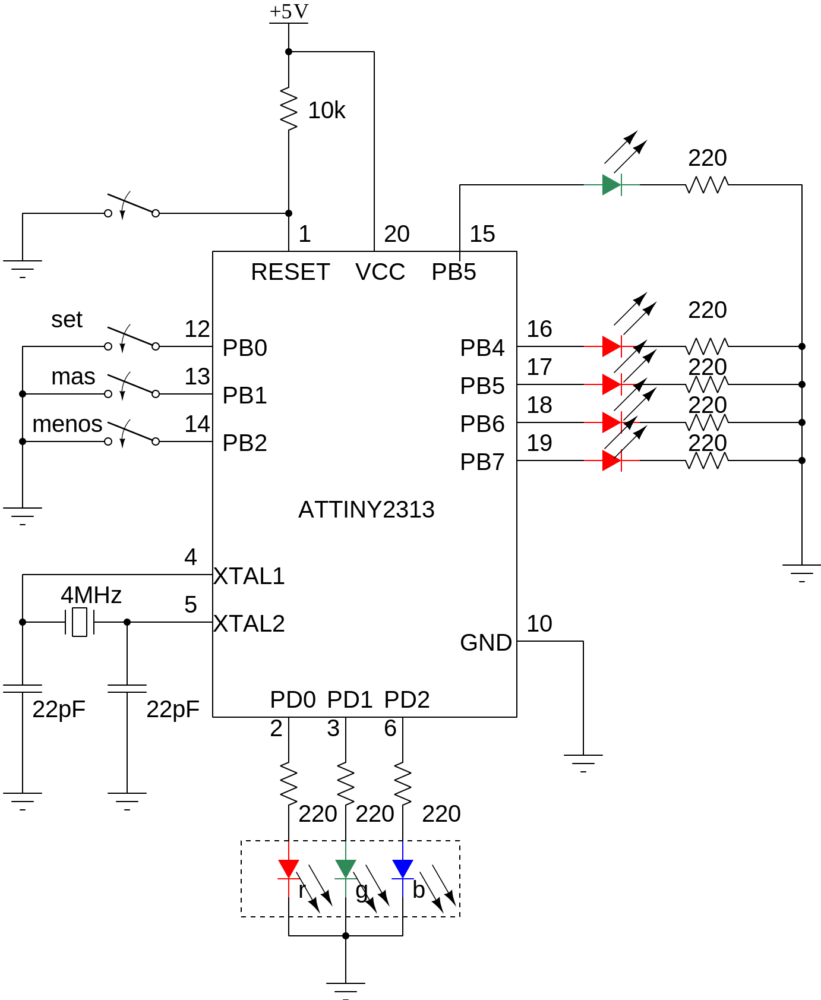

# Temporizador para Exposiciones 

**Project created with APOS (AVR Project Open Source)**


## Requerimientos

Se desea elaborar un temporizador basado en microcontrolador que cumpla con las siguientes condicionales de operación:

1. Al encender el temporizador se encuentra en estado para ajuste, los *leds de tiempo* parpadean a intervalos de 500ms. El *led de exposición* se enciende.
2.  El usuario presiona el botón **MAS** o **MENOS** para incrementar o decrementar el *tiempo de exposición*, al ajustar al valor deseado, se presiona **SET**. Esta acción apaga los leds de tiempo y apaga el *led de exposición*.
3.  El usuario presiona el botón **MAS** o **MENOS** para para incrementar o decrementa el *tiempo de Preguntas y Respuestas*, al ajustar al valor deseado, se presiona **SET**. Esta acción apaga los *leds de tiempo* y enciende el *led de exposición*. Esta acción aún no activa al temporizador.
4.  Para iniciar el temporizador presione el botón **SET**, esto hace que la *ventana semáforo* encienda en **VERDE**. El *led exposición* está encendido. Así permanece hasta que falte un minuto del tiempo ajustado. En este momento la *ventana semáforo* enciende en **AMARILLO**. Finalizado el tiempo de un minuto, la *ventana semáforo* enciende en **ROJO**. El *led exposición* permanece encendido. Ha terminado el *tiempo de exposición*.
5.  Para iniciar el *tiempo de preguntas* y respuestas se debe presionar el botón **SET**. Esta acción apaga el *led exposición* y enciende en *VERDE* la *ventana semáforo*. Así permanece hasta que falte un minuto de tiempo del tiempo ajustado; en este momento la *ventana semáforo* enciende en **AMARILLO**. Finalizado el tiempo de un minuto, la *ventana semáforo* enciende en **ROJO**. El *led exposición* permanece apagado. Ha terminado el *tiempo de apreguntas y respuestas*.
6.  Si se desea otro ciclo de Exposición presione **SET**.
7.  Sí se desea ajustar nuevos tiempos, apague y encienda de nuevo el dispositivo.

## Imagen
* Sistema base para el temporizador



## Descripción a máquina de estados

Para implementar la solución de este sistema se propone una máquina de estados finitos, la cual contiene un total de cuatro estados, los cuales se definen por:
1. AjusteTiempoExposicion
2. AjusteTiempoPreguntas
3. EjecucionTiempoExposicion
4. EjecucionTiempoPreguntas
```
Estado Actual = AjusteTiempoExposicion

mientras (verdadero) hacer:
    Si Estado Actual es igual a AjusteTiempoExposicion entonces:
        Si se presiona el botón SET entonces:
            Guardar el tiempo ajustado de exposición
            Estado Actual = AjusteTiempoPreguntas
        Si no entonces:
            Si se presiona el botón + entonces:
                Incrementar el tiempo de exposición
                Actualizar la visualización de LEDs
            Si se presiona el botón - entonces:
                Decrementar el tiempo de exposición
                Actualizar la visualización de LEDs
                
    Si Estado Actual es igual a AjusteTiempoPreguntas entonces:
        Si se presiona el botón SET entonces:
            Guardar el tiempo ajustado de preguntas
            Apagar el LED de Exposición
            Estado Actual = EjecucionTiempoExposicion
        Si no entonces:
            Si se presiona el botón + entonces:
                Incrementar el tiempo de preguntas
                Actualizar la visualización de LEDs
            Si se presiona el botón - entonces:
                Decrementar el tiempo de preguntas
                Actualizar la visualización de LEDs
                
    Si Estado Actual es igual a EjecucionTiempoExposicion entonces:
        Iniciar temporizador de exposición
        Encender LED Verde
        Mientras temporizador de exposición no haya terminado hacer:
            Actualizar visualización de LEDs
            Si queda un minuto para terminar el tiempo de exposición entonces:
                Encender LED Semáforo Amarillo
        Encender LED Semáforo Rojo
        Esperar a que usuario presione SET pasa a estado EjecucionTiempoPreguntas
        
    Si Estado Actual es igual a EjecucionTiempoPreguntas entonces:
        Iniciar temporizador de preguntas
        Encender led Verde
        Mientras temporizador de preguntas no haya terminado hacer:
            Actualizar visualización de LEDs
            Si queda un minuto para terminar el tiempo de preguntas entonces:
                Encender LED Semáforo Amarillo.
        Encender lED Semáforo Rojo.
    
    Si se presiona SET entonces:
    		Estado Actual = EjecuciónTiempoExposicion

```

## Diagrama de la máquina de estados.



El diagrama fue realizado por medio del código propuesto en [link](https://foro.elhacker.net/scripting/python_diagramacion_de_una_maquina_de_estados_fintios_fsm-t449594.0.html) dando como ventaja que la salida es SVG.

En el diagrama de flujo se pueden identificar los cuatro estados definidos como:

* A - Ajuste de tiempo Exposición
* B - Ajuste de tiempo Preguntas
* C - Ejecución Tiempo Exposición
* D - Ejecución Tiempo Preguntas

El valor indicado en la transición es el valor leído a partir de el botón SET. 
El valor de las salidas estarán controladas por una variable que se incrementará por medio de una ISR (Rutina de servicio de interrupción) y con base en su valor, se hará la actualización correspondiente, de acuerdo a cada estado en el que se encuentre la máquina.

```
ISR(TIMER0_OVF_vect) {
	contador_tiempo_exposicion++;
	if(contador_tiempo_exposicion == 14648)
	{
		minuto++;
		contador_tiempo_exposicion = 0;
	}
}
```

La definición de entradas y salidas se dispone en las siguientes tablas:

<table class = "default">
	<caption>
		<b>Entradas</b>
	</caption>
	<tr>
		<td>PB4:PB7</td>
		<td>PD0</td>
		<td>PD1</td>
		<td>PD2</td>
	</tr>
	<tr>
		<td>LEDS_TIEMPO_PIN</td>
		<td>LED_SEMAFORO_ROJO</td>
		<td>LED_SEMAFORO_VERDE</td>
		<td>LED_SEMAFORO_AZUL</td>
	</tr>
</table>

--------------------------------------------------------

<table class = "default">
	<caption>
		<b>Salidas</b>
	</caption>
	<tr>
		<td>PB0</td>
		<td>PB1</td>
		<td>PB2</td>
	</tr>
	<tr>
		<td>BOTON_SET_PIN</td>
		<td>BOTON_MAS_PIN</td>
		<td>BOTON_MENOS_PIN</td>
	</tr>
</table>

## Temporización

Dado que la naturaleza del proyecto es que sea realizada una temporización y que los leds de tiempo indiquen un incremento cada minuto:


Se usa en el microcontrolador ATtiny2313 un cristal de cuarzo de 4MHz, para ello los fuse bits se colocan de la siguiente manera:

```
LOW = 0xDC
HIGH = 0xDF
EXT = 0xFF
```

* Primero se determina F_CPU = 4000000UL
* Dado que será usado el TMR0 en modo normal (8 bits), suponiendo N = 1024
* Calcula el valor de cada desbordamiento (OVF)

**Sustición**
$$ tick = \frac{256 \cdot N}{F_{CPU}}=\frac{256 \cdot 1024}{4 \times 10^6}=65.536ms$$

* Para obtener el tiempo de un minuto se tiene que:

$$ 1 min => \frac{60 s}{65.536 ms}=915.53$$
Lo cual no entrega un valor entero, entonces, debe considerarse un valor 915 o 916
$$ x = \frac{60}{\left[ \frac{ 256 \cdot N}{F_{CPU}} \right]} =F_{CPU} \cdot \frac{60}{256 \cdot N}$$
 


* Donde x corresponde al número de ticks para que ocurra el desbordamiento.
* Bajo este esquema, se puede elaborar una expresión tal que permita seleccionar un valor adecuado para N. Considera la siguiente tabla:

<table class="default">
  <tr>
    <td>N</td>
    <td>Contador tiempo</td>
    <td>Error</td>
  </tr>
  <tr>
  	<td>1024</td>
    <td>915.52</td>
    <td>-0.051%</td>
  </tr>
    <tr>
    <td>256</td>
    <td>3662.1</td>
    <td>0.0029%</td>
  </tr>
    <tr>
    <td>64</td>
    <td>14648</td>
    <td>0.0029%</td>
  </tr>
    <tr>
    <td>8</td>
    <td>117 187</td>
    <td>0.00042%</td>
  </tr>
</table>

* Por ende, las selecciones mas adecuadas serían N = 256, 64.
* Se prefiere que N = 64 ya que es un valor entero y se puede usar una variable de tipo `uint16_t`
* Las expresiones para determinar los valores de la tabla son los siguientes:

$$ t_{obt} = \frac{x \cdot N \cdot 256}{F_{CPU}} $$

$$ E = \frac{t_d - t_{obt}}{t_d} \cdot 100 $$

## Circuito


